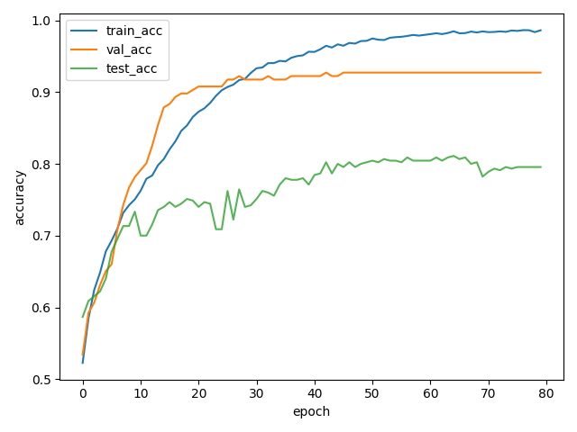
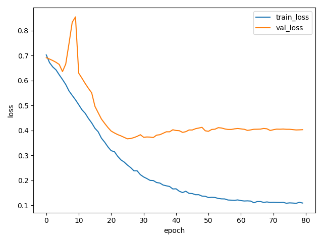
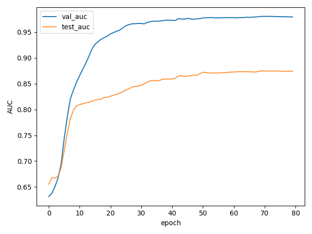
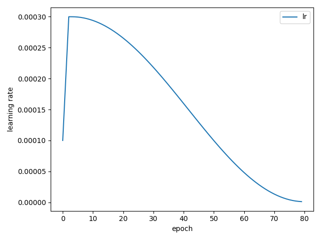

#  GFNet Alzheimer’s MRI Classifier

## Model and Problem Description 
The GFNet adopts a transformer-inspired architecture that replaces local convolutions with global Fourier-based filtering, allowing efficient long-range dependency modeling.
- **Global Fourier Filtering**: Each layer transforms the feature map to the frequency domain using FFT, applies learnable complex filters, and converts back via inverse FFT. This enables efficient global token mixing across the entire image.
- **Feed-Forward Network (FFN)**: After filtering, a two-layer MLP with GELU activation and dropout refines the features and enhances non-linear representation.
- **Normalization & Residuals**: Layer Normalization is applied before each sub-block with residual connections for stable and efficient training.
- **Projection & Classification Head**: An initial projection layer expands input channels using 1×1 convolution, followed by stacked GF blocks, global average pooling, and a linear classifier for final AD vs. NC prediction.
- **Efficiency**: The FFT-based operation provides global receptive fields with low computational cost, making GFNet suitable for high-resolution 2D MRI images.

## Dataset
- **Source**: Data can be accessed and downloaded via the following link:
https://adni.loni.usc.edu/data-samples/adni-data/
Content: It includes 2D T1-weighted MRI brain slices, each labeled as Alzheimer’s disease (AD) or Normal Control (NC).
- **Purpose**: These MRI slices are used to train a binary classifier that distinguishes AD from NC subjects based on structural brain features.
- **Preprocessing**:
Resized all images to 224×224 pixels.
Normalized grayscale intensity values to [−1, 1].
Applied gamma correction and Gaussian noise for contrast enhancement and data augmentation.
- **Data Split**:
Training, validation, and testing sets are divided on a subject-wise basis to prevent data leakage.
The dataset is approximately class-balanced to ensure unbiased evaluation.
## Usage
### Training
The following are the configuration parameters required for model training:
| Argument | Description | Type | Default |
| ----- | ----- | ----- | ----- |
| `data_root`               | Root directory of the dataset, e.g., .../root/AD_NC | `str` | Required |
| `outdir`         | Output directory for saving checkpoints and plots | `str` | runs/adni_gfnetquired |
| `img_size` | Input image resolution | `int` | 224 |
| `batch_size` | Number of samples per training iteration | `int` | 32 |
| `workers` | Number of data loading workers | `int` | 16 |
| `epochs` | Total number of training epochs | `int` | 80 |
| `lr`| Initial learning rate (with cosine warmup schedule) | `float` | 3e-4 |
| `weight_decay` | L2 regularization strength | `float` | 5e-3 |
| `in_channels` | Number of input channels  | `int` | 1 |
| `seed` | Random seed for reproducibility | `int` | 42 |
- **Learning rate schedule**: Linear warmup (first 3 epochs) followed by cosine decay to 1e-6.
- **Optimizer**: AdamW (decoupled weight decay).
- **Loss function**: Cross-entropy with optional label smoothing (0.02).
- **Regularization**: Dropout (0.3 in model), AutoTuner dynamically adjusts weight decay, label smoothing, and dropout based on training–validation gap.
- **Temperature Scaling**: Applied every 5 epochs using validation set for post-hoc calibration.
- **Early stopping**: Not enabled (patience=0 by default), training proceeds for full epochs.
Use the provided training script (e.g. train.py) to train the model. Example command:
```bash
python train.py --data_root path/to/ADNI/AD_NC --outdir runs/experiment1 \
    --img_size 224 --batch_size 32 --epochs 80 --lr 3e-4 --workers 16 --seed 42
```
### Prediction
| Argument | Description | Type | Default |
| ----- | ----- | ----- | ----- |
| `--ckpt`        | Path to the model weights | `str` | Required |
| `--data_root`   | Root directory of the dataset; must contain subfolders for evaluation  | `str` | Required |
| `--split`       | Subdirectory under data_root for evaluation (e.g., validation, test) | `str` | `validation` |
| `--image`       | Path to a single image for individual inference | `str` | `None` |
| `--batch_size`  | Batch size for folder-based batch prediction | `int` | `64` |
| `--num_workers` | Number of DataLoader workers for inference | `int` | `0` |
| `--device`      | Device for inference (cuda, cpu, or mps) | `str` | `cuda` |
| `--save_dir`    | Directory to save prediction results | `str` | `pred_out` |

### Dependencies
| Dependencies | Version|
| ----- | ----- |
| Python | 3.13.6 | 
| torch | 2.7.1 + cu118 |
| torchvision | 0.22.1 + cu118| 
| numpy| 2.1.2 |
| scikit-learn | 1.7.1 | 
| matplotlib | 3.10.5 | 
| pillow | 11.0.0 | 
| tqdm | 4.67.1 |
- **Reproducibility**: We set a fixed random seed (42) for initialization and data splitting to ensure results are reproducible. The code calls torch.manual_seed, random.seed, and numpy seed to synchronize randomness. For complete determinism, you can additionally set torch.backends.cudnn.deterministic = True and torch.backends.cudnn.benchmark = False, though this may slow down training. All model weights and training logs can be saved to allow result verification. Given the same seed and environment, you should obtain very similar performance (around 0.81 test accuracy). Minor differences may occur due to non-deterministic GPU operations, but these are negligible for overall metrics

## Results
After training on the ADNI MRI slices, the GFNet model achieved strong performance in distinguishing AD vs NC:

Test Accuracy: ~0.81 (81%). This means the model correctly classifies 81% of held-out test images (subject-level evaluation). Given the challenging nature of MRI-based diagnosis, this accuracy demonstrates that the model has learned meaningful biomarkers of Alzheimer’s.

ROC AUC: ~0.85–0.88 on the test set. The Area Under the ROC Curve indicates the model’s discrimination capability between AD and NC across all classification thresholds. An AUC in the high 0.8s suggests the model is capturing the separation between classes well (with an AUC of 1.0 being perfect separation).

The training and validation metrics over epochs are shown in the figures below:


        Figure 1: Training vs. validation vs test accuracy per epoch.
 Both training (blue line) and validation accuracy (orange line) improve steadily and converge by around 50–60 epochs. We also plot test accuracy (green dashed line) for reference, which stays slightly below validation, ending at ~81%. The gap between training and validation accuracy is small, indicating minimal overfitting. The model learns to generalize well — training accuracy reaches ~85% while validation plateaus near 80%, suggesting the regularization (dropout, etc.) was effective.




        Figure 2:Training vs. validation loss per epoch.
The training loss (blue) decreases smoothly over epochs, while validation loss (orange) follows a similar downward trend and stabilizes toward the end of training. There is no significant divergence between training and validation loss, again confirming that the model did not severely overfit. The final validation loss is low, corresponding to confident and mostly correct predictions on the val set.



        Figure 3:Validation and test ROC AUC per epoch.
We monitor the AUC on the validation set (orange) each epoch; it climbs to the high 0.8s, indicating improving classification robustness. The best validation AUC was used to select the best model. The test AUC (green) is plotted for reference and remains close to the validation curve, reaching about 0.86–0.87 by the end. High AUC values show the model achieves a good trade-off of sensitivity and specificity for AD detection.



        Figure 4: Learning rate schedule over epochs.
This plot illustrates the cosine annealing schedule with an initial warmup. The learning rate quickly ramps up in the first 3 epochs (warmup), hits the base rate (3e-4), then gradually decreases following a cosine decay to a very low rate by epoch 80. This scheduling helps to initially quickly fit the data and later fine-tune and stabilize training, which likely contributed to the smooth convergence of loss.

Overall, the model’s performance is strong: an 81% accuracy and high AUC suggest it is feasible to classify AD from a single MRI slice with reasonable confidence. The training curves show stable training and validation behavior. There is no evidence of severe overfitting, as validation metrics track training metrics closely. The final model can be used to predict Alzheimer’s presence on new MRI scans, potentially assisting in preliminary screening or supporting diagnostic decisions.

## References
[1] Y. Rao, W. Zhao, B. Liu, P. Zhou, J. Lu, and J. Zhou, “Global Filter Networks for Image Classification,” Advances in Neural Information Processing Systems (NeurIPS), vol. 34, 2021, pp. 980–993. [Online]. 
Available: https://arxiv.org/abs/2107.00645

### AI Assistants
[2] use OpenAI ChatGPT5 to improve my code